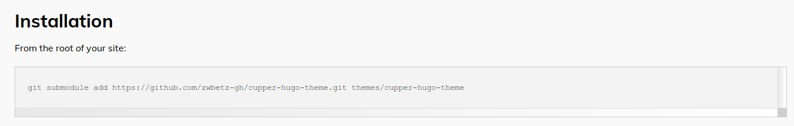
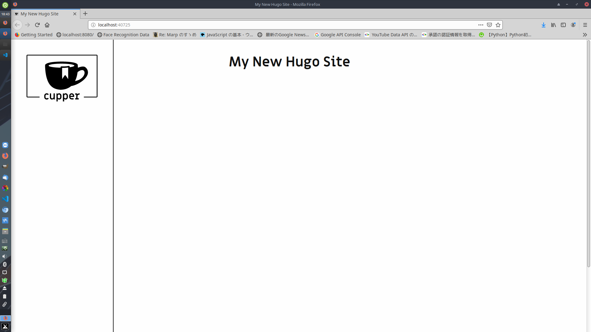
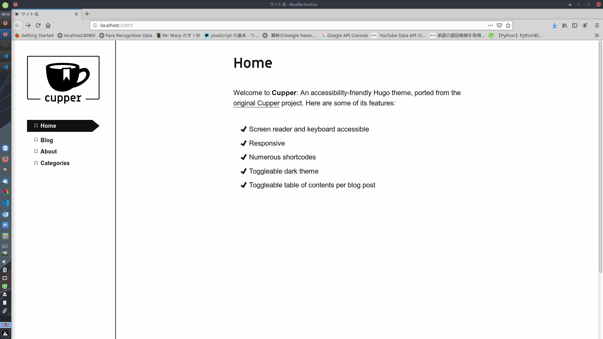
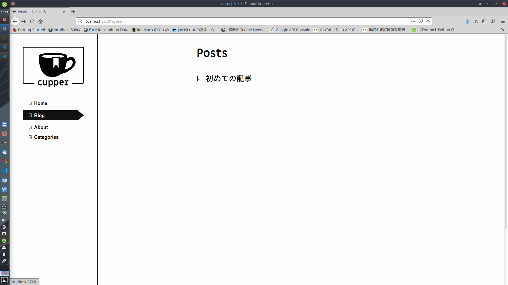

こんにちは, hiratchi です.
この記事では, どのようにしてこのサイトを作ったかを解説します.
言わずもかな GitHub と Hugo という静的サイトジェネレータを用いて約20分で出来上がります.
記事はMarkdown で書けるので, 普段 Latex とか使うタイプの人ならば親和性が高いと思います.

---
# 目次：サイトを作るまで　

0. [Git, Hugo のインストール](#0)
1. [GitHub に2つのリポジトリ(コード管理用、公開用)を作成・クローン](#1)
2. [サイトの作成・テーマの適用](#2)
3. [自分なりにサイトをカスタマイズ](#3)
4. [deploy.sh の作成&実行](#4)
---

以下, 順に解説していきます.

## 0.Git,Hugoのインストール {#0}
Git は言わずともしれたコード管理ツールの一つです(知らない人は[コチラ][saru]).
アカウントないよって人は[ココ][git]で登録しましょう.
Git については[コチラ][1]を参照して, 入れてみてください.

Hugo はGO言語(自分もよく知らない)で書かれた静的サイトジェネレータです.
Markdown で記事がかけたり, 特に知識がなくてもテーマが豊富なので, すぐにいい感じのサイトが作れます.
Hugo についても同様にコチラ([Linux][4], [Mac][5], [Windows][6])を参照して, 入れてみてください.

## 1.GitHubに2つのリポジトリを作成・クローン {#1}
[この記事][7]に倣って, コードの管理用のリポジトリと, デプロイ(公開)用のレポジトリを作ります.
自分のGitHub にアクセスして, 管理用の `blog_src`(名前は任意)と, デプロイ用の `<ユーザ名>.github.io`(指定)というレポジトリを作成してください.
あとでクローンするのでREADMEの作成オプションは有効化しといてね.
んで, ローカルに `blog_src` の方をクローンしましょう.
```console
$git clone https://github.com/<ユーザ名>/blog_src.git
```
基本的にはこっちをカスタマイズしていきます, もう片方は自分でいじることはほとんどありません.

## 2.サイトの作成・テーマの適用 {#2}
いよいよサイトを作ります, といっても難しいことは何一つとしてしません.
blog_src フォルダのある階層で
```console
$hugo new site blog_src --force
```
とやります. 
`hugo new site [サイトの名前]` で hugo は新しいサイトを作ってくれます.
今回は空でない blog_src フォルダに作っちゃうので`--force` としていますが, あんまりよろしくはないです.
こうして, めでたくサイトの作成は完了です.

次にテーマを適用します.
[ココ][themes]を見ればわかるように, めっちゃテーマが公開されてます.
好きなのを選んで, 作りましょう.
このブログは [academia][academia] というテーマを使っていますが, 今回は [Cupper][cupper] を使ってみます.
どのテーマを使っても良いです, 基本的には下の画像のようにテーマのページの Installation ってとこに従えばだいたいできます.

blog_src に入って以下を実行します.
```console
$git submodule add https://github.com/zwbetz-gh/cupper-hugo-theme.git themes/cupper-hugo-theme
```
これで, テーマを適用しました. `hugo server` コマンドでローカルのサーバを立ち上げることができます.
```console
$ hugo server -t cupper-hugo-theme
  :
  :
  :
Web Server is available at http://localhost:39181/ (bind address 127.0.0.1)
```
一番最後に出てきたアドレスをブラウザのアドレスバーにコピペして, どんなページができているか確認してみましょう.
(`-t` オプションはテーマを指定してサーバを立ち上げます.)


こんな感じになったらとりあえず成功です.
`Ctrl+C` でサーバーを閉じてあげましょう.

## 3.自分なりにサイトをカスタマイズ {#3}
ここまできたらあとはあなたの好きにしましょう.
基本的には`config.toml` ファイルをいじってサイトの構成を変えていきます.
今回はブログを作るのに最低限必要だと思うものを以下においておきます.

config.toml
```python:config.toml
# サイトの基本設定
title = "サイト名"
baseurl = "https://hiratchi.github.io/"
copyright = "(c) {year} Tomoya HIRAKAWA"

# 言語設定
defaultContentLanguage = "ja"  # 出力後の <html lang=""> の部分
hasCJKLanguage = true          # trueにすると、日中韓の言語で文字カウントとかが正しく動作する
hrefTargetBlank = true
theme = "cupper-hugo-theme"

paginate = 10  # Number of items per page in paginated lists.
enableEmoji = true

enableGitInfo = true #記事の更新日

[menu] # メニューバーの設定
  [[menu.nav]]
    name = "Home"   # 表示される名称
    url = "/"    # 参照するアドレス
    weight = 1
  [[menu.nav]]
    name = "Blog"   # 表示される名称
    url = "/post/"    # 参照するアドレス
    weight = 2
  [[menu.nav]]
    name = "About"   # 表示される名称
    url = "/about/"    # 参照するアドレス
    weight = 3
  [[menu.nav]]
    name = "Categories"   # 表示される名称
    url = "/categories/"    # 参照するアドレス
    weight = 4

[taxonomies]
  tag = "tags"
  category = "categories"
```
また, `themes/exampleSite/content` にある `themes/exampleSite/content/_index.md` と, `themes/exampleSite/content/about.md` をルートフォルダの`/content` にコピーしておきます.
ここで, `$hugo server` してあげると...

こんな感じになっていると思います.
なんか出来上がってきましたね.
もうお察しかと思われますが, `content` フォルダ内の`.md` ファイルが表示されます.
このファイルをいじってあげれば自分好みのHome, About 画面を作れますよ.
しかしこの状態でBlog をクリックすると404エラーが出てしまいます.
だって,　記事何も書いてないんだもの...
ってことで, 記事を作成しましょう!

```console
$hugo new post/first.md
```
実行すると`content/post`に`first.md`というファイルができていると思います.
これが記事の正体です.
こいつをこんなふうに書いてみましょう.

content/post/first.md
```markdown
---
title: "初めての記事"
date: 2020-01-09T19:18:36+09:00
draft: false
---

こんにちは、ようこそブログへ！
```
これで, 記事が完成しました.
draft は true だと, 「下書き」扱いになって, 普段は表示されません.

`$hugo server`を行ってBlog を開いてみると...

記事がきちんと投稿されている！

ってことでまとめると, blog の記事を作成するには
```console
hugo new post/<ファイル名>.md
```
を行えば良いんです, 簡単でしょ, うん.
markdown ファイルの上部は, 記事のメタデータになっていて, タグやカテゴリも追加できます.

例
```markdown
---
title: "初めての記事"
date: 2020-01-09T19:18:36+09:00
draft: false
tags: ['タグ1', 'タグ2', 'タグ3']
---

こんにちは、ようこそブログへ！
```
調べたらいろいろ出てきますのでお試しあれ.

## 4.deploy.shの作成&実行 {#4}
ここからは作ったサイトをネット上に公開していきます.
まずは下準備から, `blog_src` の中で以下を実行します.
```console
# publicディレクトリを削除。
$ rm -rf public
# publicディレクトリを公開先リポジトリとしてサブモジュール化する(最初の設定のときに1回だけ行う)
$ git submodule add -b master git@github.com:<ユーザ名>/<ユーザ名>.github.io.git public
```
次に, `blog_src`フォルダ直下に`deploy.sh`を作ります.
自分がなにか`blog_src` フォルダ内のファイルをいじってサイトに変更を加えたあとに, この`deploy.sh`を実行することで, ネット上に公開されているサイトに変更が反映されます.

deploy.sh
```bash

echo -e "\033[0;32mDeploying updates to GitHub...\033[0m"

# Build the project.
hugo -t academic

# Go To Public folder
cd public
# Add changes to git.
git add .

# Commit changes.
msg="rebuilding site `date`"
if [ $# -eq 1 ]
  then msg="$1"
fi
git commit -m "$msg"

# Push source and build repos.
git push origin master

# Come Back up to the Project Root
cd ..

# Commit source repository changes
git add .
git commit -m "$msg"
git push

```

最後にこのファイルを実行してあげましょう.
```console
$./ deploy.sh
```
最後に, ブラウザで`https://<ユーザ名>.github.io` にアクセスしてみてください.
できていましたか?

これでブログが出来上がったはずです.
あとは記事を投稿したりだとか, テーマを変えてみたりだとかいろいろ好きにやっちゃってください.
ググればたくさん出てきます.

---
### 参考
[サルでもわかるGit入門][saru]

[HUGOでブログ作成 → GitHub Pagesで公開する手順][7]

[HUGOをインストールしてみた][4]

[テーマ Cupper のカスタマイズ](https://k-kaz-git.github.io/post/hugo-custom-theme-cupper/)

<!-- reference -->
[saru]:https://backlog.com/ja/git-tutorial/
[git]:https://github.com
[themes]:https://themes.gohugo.io/
[academia]:https://themes.gohugo.io/academia-hugo/
[cupper]:https://themes.gohugo.io/cupper-hugo-theme/
[1]:https://git-scm.com/book/ja/v2/%E4%BD%BF%E3%81%84%E5%A7%8B%E3%82%81%E3%82%8B-Git%E3%81%AE%E3%82%A4%E3%83%B3%E3%82%B9%E3%83%88%E3%83%BC%E3%83%AB
[4]:https://plus-n.work/2019/01/406/
[5]:https://nyagosu.net/develop/web/hugo-mac/
[6]:https://benkyosukisuki.com/create/create-lifehack-hugo-on-windows/
[7]:https://chanmitsu55.github.io/2017/12/25/2017-12-25-create-blog-by-hugo/