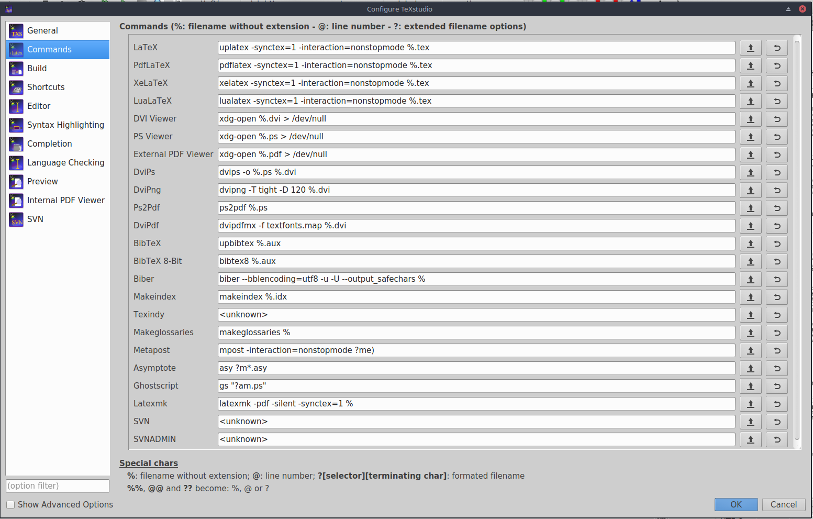

こんにちは, hiratchi です.
皆さんも, 締切前日にWord で書いていた文書をTeXで書き直さなくてはならないことって多いと思います(ない).
僕もそうでした.
この記事では僕が約30分（ネット環境に大きく依存）で行った超速であり超適当なLaTeX 導入を備忘録的にメモします.
パッケージマネージャとして`apt` を採用しているUbuntu とかでも出来るような気がしてますがやるのは自己責任でお願いします.

## 導入
なんと言っても`texlive`ですよね.
ってことでとりあえずインストールします.
```console
$sudo apt install texlive-full
```
ネットの環境によってはかなり時間がかかるし通信量もごっそり持ってかれます(5GB程度).
僕は学校のネット使って`texlive-full`をインストールしました, ごめんなさい.
日本語関連ものだけでいい！って人は上記の代わりに以下で良いです.
```console
$sudo apt install texlive-lang-japanese
```
さて, 上記のいずれかをインストールできたらもう終わったようなもんです.
僕はいつもTeX文書を書くときにはTeXstudio を使っています.
スペルチェックもできるし, ウィザードで図の挿入や簡単な表の挿入もできちゃいます.
ので, こいつを入れちゃいます.
```console
sudo apt install texstudio
```
これで完了です.
コマンドラインで`texstudio` と打てば起動するはずです.

## 設定
 実際に起動し, TeXをコンパイルしようとするとエラーがドヒャっと出てきて, ちびると思いますのでTeXstudio の設定もしときます.
いろいろなサイトを参考にできちゃう人はそれでいいです.
`Options > Configure TeXstudio...` で設定いじれますのでココをいろいろ変えてきます.

まずは`Commands`タブです.
ここでは, LatexやBibTexのコマンド等を設定します.
デフォルトから変わってないところのほうが多いです.

具体的には,
* LaTeX: `latex` を `uplatex` に変更, `-src` を `-synctex=1` に変更
* DviPdf: `dvipdfm` を `dvipdfmx -f textfonts.map %.dvi` に変更
* BibTeX: `bibtex` を `upbibtex` に変更
* Biber:  `biber` を `biber --bblencoding=utf8 -u -U --output_safechars` に変更

こんな感じでしょうか, DviPdf の設定に関して言えば, フォントを埋め込む必要のない方は「`dvipdfm` を `dvipdfmx` に変更」と読み替えておいてください.

次にビルドの設定をします.
TeXstudio ではコンパイルして画面の右側にプレビューを表示してくれます.
`Build` タブに切り替えて, `Build & View` の部分を `DVI->PDF Chain` に変更しておきます.

僕がやった設定は以上です.

## 最後に
備忘録的記事なので必然的に雑記事になってしまいました.
結果的に誰得な記事になっちゃいましたが, 急にTeX 環境が必要になったあなたの力になれたら幸いです. 