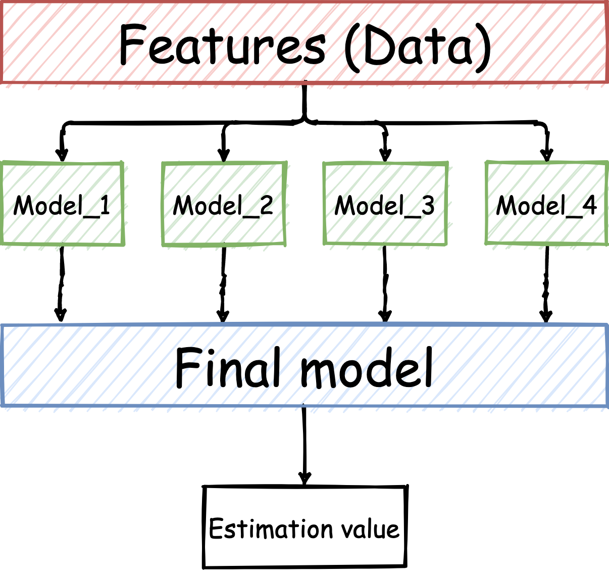
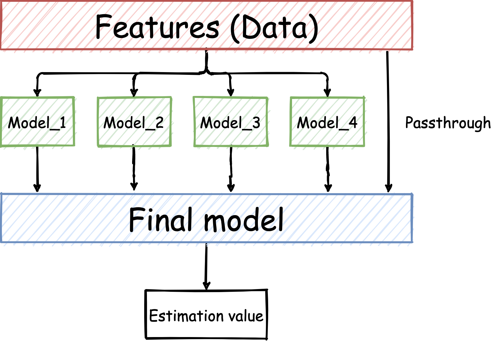

# はじめに
最近、kaggle等の機械学習コンペが流行っていますね。
先日、参加したインターンシップでのコンペもkaggleで出題されるようなお題だったため、kaggleで使われているテクである`Stacking`を使用させていただきました。
これまた備忘録となりますが、コードと共に記事にします。

# Stackingとは
まずはStackingについて説明します。
RandomForestといったアルゴリズムは決定木をアンサンブルする手法として知られていますが、Stacking は性質の異なる様々な学習器のアンサンブルとも言えます。

具体的には、ある問題に対する解法となる学習器を複数（ここでは\\(N\\)個）用意します。
すると、\\(N\\)個の学習器それぞれに、推定値が存在します。
それら\\(N\\)個の推定値を「新たな特徴」として、別に準備した１つの学習器で使用します。
最終的な結果としては１つの学習器の推定値が出力されます。
言葉のみではわかりづらいため、図に示した例について説明します。



この例では、まず元のデータから、`Model_1`、`Model_2`、`Model_3`、`Model_4`の学習器を学習させます。
それらの推定値を`Final model`という学習器で使用する特徴として、学習させます。
この例での最終的な推定値は、`Estimation value`となります。

ここで、`Model_1`、`Model_2`、`Model_3`、`Model_4`については、どんなモデルを用いても構いません。
kaggleの解法なんかをみてみると、`LightGBM`を大中小と、`Neural Network`と`Catboost`を組み合わせたりしていたり。

# 実装してみる

使用したコードは[こちら](stacking.py)

このStackingについては`scikit-learn`を用いると簡単に実装することができました。
今回も適当な２値分類問題を解くようなStackingを実装してみましょう。
今回は、`Model_1: RandomForest`、`Model_2: GradientBoosting`、`Model_3: Histogram-BasedGradientBoosting`、`Model_4: AdaBoost`とし、`Final Model`として`NeuralNetwork`を用いることにします。
簡単のため、ハイパラ調整は行わず、ライブラリのデフォルト値を使います。

まずは必要なライブラリのインポートから。
今回は分類問題を解くということで、簡単に`accuracy`の評価値をみていきます。

```python
import numpy as np
from sklearn.metrics import accuracy_score
from sklearn.model_selection import train_test_split
from sklearn.datasets import make_classification
from sklearn.ensemble import RandomForestClassifier, AdaBoostClassifier, GradientBoostingClassifier, StackingClassifier
from sklearn.neural_network import MLPClassifier

# 並列処理用
import multiprocessing
cores = multiprocessing.cpu_count()
```

そして、擬似的な２値分類問題を生成します。
データ数は`500`、特徴量次元は`64`としておきましょう。
また、訓練用データと検証用データを`train_test_split`で分割しておきます。

```python
X, y = make_classification(n_samples = 500, n_features = 64, n_informative = 16, n_classes = 2, random_state = 2021)

X_train, X_test, y_train, y_test = train_test_split(X, y, test_size = 0.2, random_state = 2021, stratify = y)
```

では早速、使っていく４つのモデルを定義します。
今回使用する`StackingClassifier`は、各モデルを`(名前, モデル)`のタプル型を要素とする辞書型で定義してやる必要があります。
そのため、以下のように`models`を定義します。

`MLPClassifier`については、しばしば`ConvergenceWarning`が出てきちゃうので、反復回数`max_iter`を増やしています。

```python
models = {
    ("RandomForest", RandomForestClassifier()),
    ("GradientBoosting", GradientBoostingClassifier()),
    ("NeuralNetwork", MLPClassifier(max_iter = 10000)),
    ("AdaBoost", AdaBoostClassifier())
    }
```

まずは、これらのモデルの単体での精度を調べてみます。

```python
for name, model in models:
    acc = accuracy_score(y_test, model.fit(X_train, y_train).predict(X_test))
    print("Accuracy of", name, ":", acc)
```

すると以下のような結果になりました。

```
Accuracy of GradientBoosting : 0.79
Accuracy of AdaBoost : 0.76
Accuracy of NeuralNetwork : 0.82
Accuracy of RandomForest : 0.76
```

それでは、今回のテーマの`Stacking`を実装します。

```python
stacking = StackingClassifier(estimators = models, final_estimator = MLPClassifier(), n_jobs = cores)
```

たった１行でできちゃうんですね…。
すごい時代になったもんだ、なんて呟いている間に精度を調べてみましょう。

```python
acc = accuracy_score(y_test, stacking.fit(X_train, y_train).predict(X_test))
print("Accuracy of Stacking :", acc)
```

こちらの結果となりました。

```
Accuracy of Stacking : 0.83
```

### 実験まとめ
```
Accuracy of GradientBoosting : 0.79
Accuracy of AdaBoost : 0.76
Accuracy of NeuralNetwork : 0.82
Accuracy of RandomForest : 0.76
------------------------------------
Accuracy of Stacking : 0.83
```

確かに、単体のどのモデルよりも高い`accuracy`が出ているのがわかります。
各モデルのハイパラ調整をしたらもっと精度が上がりそうですね。

ハイパラ調整についての記事は[こちら](https://t0m0ya1997.github.io/blog/post/optuna/)。


# まとめ
機械学習コンペでも頻出のスタッキングを実装してみました。
今回はどの単体モデルの予測精度よりも、上回る結果を得ることができました、
しかしながら、Stacingを行うことによって精度が落ちてしまうといったケースも存在するようです。

本記事では分類問題を扱いましたが、回帰問題についても`sklearn.ensemble.StackingRegressor`を使えば簡単に実装できちゃいます。機械学習コンペでなかなかスコアが上がらない…という方は試してみてはいかがでしょうか。


# 補足：passthroughについて

実は`sklearn`の`StackingClassifier`及び`StackingRegressor`にはパラメータとして、`passthrough`というブール値が存在します。
この`passthrough`についてですが、図にしてみました。



`passthrough`は元のデータを最終的な学習器が使用するか否かを示すブール値になります。
`True`であれば図中の`Features`から`Final Model`への矢印は存在し、`False`なら存在しないことになります。
どちらが良いとは一概には言えませんが、意味を理解しておいた方が良いパラメータです。


## 参考
1. [sklearn公式](https://scikit-learn.org/stable/modules/generated/sklearn.ensemble.StackingClassifier.html)
2. [機械学習】scikit-learnで学ぶstacking](https://tma15.github.io/blog/2020/03/29/機械学習scikit-learnで学ぶstacking/)
3. [最新アンサンブル学習SklearnStackingの性能調査(LBGM, RGF, ET, RF, LR, KNNモデルをHeamyとSklearnで比較する)](https://qiita.com/r2en/items/61b3b7fa70d2b65021d0)
4. [scikit-learn0.22.0から実装されたスタッキングクラスを試してみた](https://techtech-sorae.com/scikit-learn0-22-0から実装されたスタッキングクラスを試して/)